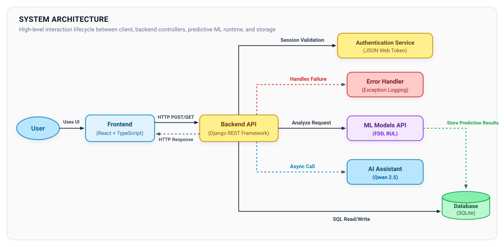
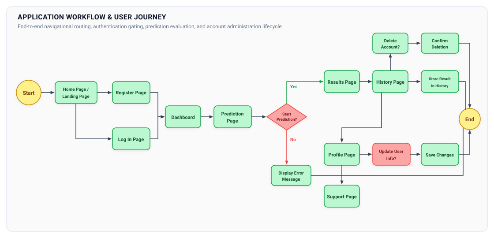

# Industrial Power Transformer Predictive Maintenance and Health Monitoring System

An industrial-grade telemetry monitoring, fault diagnosis, and remaining useful life estimation system designed for high-voltage power transformers in critical electrical grid infrastructure and nuclear power generation facilities.

## Overview and Background

Power transformers constitute critical primary assets within electrical transmission grids and nuclear power plant (NPP) distribution substations. Unexpected dielectric breakdown or mechanical winding failure incurs severe economic losses and endangers grid stability. Traditional time-based maintenance protocols fail to detect incipient thermal and electrical faults, whereas continuous online Dissolved Gas Analysis (DGA) provides the empirical basis for condition-based predictive maintenance.

This project implements an end-to-end industrial software and machine learning infrastructure for automated Fault Detection and Diagnosis (FDD) and continuous Remaining Useful Life (RUL) forecasting.

### Institutional and Industrial Context

* Industrial Partner: Developed in the interests of JSC "TVEL" (State Atomic Energy Corporation "Rosatom").
* Academic Attribution: Higher Institute of Information Technology and Intelligent Systems (ITIS), Kazan Federal University (2025).
* Project Defense: Defended with distinction ("Excellent") and officially recommended for industrial evaluation within nuclear energy transmission infrastructure.
* Domain: High-Voltage Electrical Asset Health Monitoring, Dissolved Gas Analysis (DGA), Incipient Fault Diagnosis, Time-to-Failure Regression.

---

## Dataset and Mathematical Formulation

### Signal Ingestion Specifications

The empirical foundation comprises 3,000 independent operational time-series records across high-voltage power transformer units, encompassing approximately 1,260,000 total measurement points.

* Temporal Resolution: Telemetry sampled at uniform 12-hour intervals.
* Sequence Length: 420 consecutive readings per asset record, capturing 210 continuous days of operational telemetry.
* Input Feature Vector (D = 5):
  * Hydrogen (H2) [ppm]: Incipient arcing and low-energy electrical discharge indicator.
  * Carbon Monoxide (CO) [ppm]: Cellulosic paper insulation thermal decomposition indicator.
  * Ethylene (C2H4) [ppm]: High-temperature oil cracking (>500 deg C) indicator.
  * Acetylene (C2H2) [ppm]: High-energy electrical arcing (>700 deg C) indicator.
  * Top-Oil Operating Temperature [deg C]: Thermal loading parameter.

### Dual Prediction Targets

1. Fault Detection and Diagnosis (FDD):
   Multi-class state classification at each time step across four operational classes subjected to an extreme 19:1 class imbalance:
   * State 1: Normal Operational Condition (81.0% of dataset).
   * State 2: Partial Discharge (PD) - cold dielectric breakdown.
   * State 3: Low-Energy Discharge (D1) - spark discharge and tracking.
   * State 4: Low-Temperature Thermal Overheating (T1) - decomposition below 300 deg C.

2. Remaining Useful Life (RUL):
   Continuous regression estimating the remaining operational steps prior to critical asset failure:
   * Target Horizon: Steps ranging from 362 to 1,093 steps.
   * Metric Conversion: Total Remaining Hours (T_hours) = RUL_steps * 12 hours.

### Mathematical Formulation

Given an input multivariate sequence for asset $i$:

$$
\mathbf{X}_i = [\mathbf{x}_1, \mathbf{x}_2, \dots, \mathbf{x}_T]^T \in \mathbb{R}^{T \times D}
$$

where $T = 420$ time steps and $D = 5$ physical telemetry features.

For the multi-class Fault Detection and Diagnosis (FDD) task, the model estimates the posterior class probability distribution:

$$
P(y_{\text{FDD}} = k \mid \mathbf{X}_i), \quad k \in \{1, 2, 3, 4\}
$$

optimizing class-weighted cross-entropy loss to mitigate the 19:1 class imbalance:

$$
\mathcal{L}_{\text{FDD}} = -\sum_{k=1}^K w_k \cdot y_{i,k} \cdot \log(p_{i,k})
$$

where $w_k$ denotes the inverse class frequency weighting penalty.

For the continuous Remaining Useful Life (RUL) regression task, the mapping estimates time-to-failure over the operational domain:

$$
\hat{y}_{\text{RUL}} = f(\mathbf{X}_i) \in [362, 1093]
$$

Model convergence and predictive accuracy are evaluated via Mean Absolute Error (MAE), Root Mean Squared Error (RMSE), and the Coefficient of Determination ($R^2$):

$$
\text{MAE} = \frac{1}{N} \sum_{i=1}^N |y_i - \hat{y}_i|
$$

$$
\text{RMSE} = \sqrt{\frac{1}{N} \sum_{i=1}^N (y_i - \hat{y}_i)^2}
$$

$$
R^2 = 1 - \frac{\sum_{i=1}^N (y_i - \hat{y}_i)^2}{\sum_{i=1}^N (y_i - \bar{y})^2}
$$

---

## Methodology

### Raw Sequence Baseline Failure Analysis

Initial modeling utilizing raw sensor sequences without temporal transformation failed to establish actionable predictive bounds, yielding R^2 <= 0.20 across standard regressors. Investigation revealed three primary failure drivers:
1. Heavy right-skewed gas concentration distributions spanning three orders of magnitude.
2. Inconsistent gas diffusion rates masking linear correlation with remaining operational life.
3. High sensor noise and non-stationary baseline drift in continuous factory telemetry.

### Domain Feature Engineering Pipeline

To capture degradation dynamics, a deterministic feature engineering pipeline was implemented:
* Temporal Derivatives: First-order derivatives (dG/dt) and second-order derivatives (d^2G/dt^2) across each dissolved gas to monitor fault acceleration rates.
* Rolling Window Aggregations: 3-step moving statistics (mean, standard deviation, minimum, maximum, median) to dampen local high-frequency sensor anomalies.
* Multi-Step Lag Dynamics: Lag features up to order 3 [G(t-1), G(t-2), G(t-3)] to capture autoregressive physical progression.
* Spectral Decomposition: Fast Fourier Transform (FFT) peak frequency and spectral energy extraction to identify periodic load cycles and degradation resonance.
* Stoichiometric Gas Ratios: Standard international diagnostic ratios following IEC 60599 and Rogers ratios, specifically CO/H2 (cellulose vs. oil degradation) and C2H2/C2H4 (electrical discharge vs. thermal overheating).

### Feature Extraction Benchmark: tsfresh vs. TSFEL

An exhaustive feature extraction benchmark was executed between two algorithmic time-series libraries:

* tsfresh (MinimalFCParameters): Extracted 300+ temporal, distribution, and autocorrelation features per window.
* TSFEL (Time Series Feature Extraction Library): Extracted 993 spectral, statistical, and temporal features per window.

Evaluation demonstrated that tsfresh produced a superior feature subset with higher mutual information and reduced collinearity. TSFEL generated substantial multi-collinear redundancy that degraded gradient-boosted tree splits. tsfresh enabled champion performance, achieving an F1-score of 0.92 for FDD and R^2 of 0.86 for RUL.

### Non-Leakage Validation Strategy

Time-series cross-validation requires strict structural isolation of individual transformer units. Conventional random K-Fold or standard time-based cross-validation leaks temporal sliding window dependencies between folds.

* Validation Architecture: Enforced strict GroupKFold (k = 5) partitioned strictly by transformer asset ID.
* Zero Cross-Asset Leakage: Telemetry windows belonging to an asset in the test split are never present in the training split.
* Preprocessing Isolation: Feature selection, imputation, and scaling parameters are fitted strictly on training folds and transformed onto test folds.

### Feature Selection and Imbalance Mitigation

* Outlier-Resistant Scaling: RobustScaler utilizing median and Interquartile Range (IQR) to normalize gas concentrations without collapsing high-magnitude fault spikes into extreme outliers.
* Feature Attribution: TreeExplainer via SHAP (SHapley Additive exPlanations) combined with Recursive Feature Elimination (RFE) to reduce the extracted 300+ features to the most informative physical predictors.
* Minority Resampling: Synthetic Minority Over-sampling Technique (SMOTE) applied exclusively to the training folds of the FDD pipeline to equalize the 19:1 class disparity without biasing the validation distribution.

---

## Benchmark Results

### Fault Detection and Diagnosis (FDD) Multi-Class Benchmark

Models were trained on identically preprocessed folds using GroupKFold(5) cross-validation. Metrics reflect macro-averaged scores across all four operational states.

| Model Architecture | Accuracy | Macro Precision | Macro Recall | Macro F1-Score | Status |
| :--- | :--- | :--- | :--- | :--- | :--- |
| K-Nearest Neighbors (KNN) | 0.87 | 0.70 | 0.82 | 0.74 | Baseline |
| Decision Tree Classifier | 0.90 | 0.76 | 0.81 | 0.77 | Baseline |
| Deep Neural Network (DNN) | 0.94 | 0.81 | 0.89 | 0.84 | Candidate |
| Gated Recurrent Unit (GRU) | 0.86 | 0.87 | 0.86 | 0.84 | Candidate |
| Logistic Regression (L2 Regularized) | 0.94 | 0.84 | 0.93 | 0.88 | Candidate |
| Random Forest Classifier | 0.96 | 0.88 | 0.90 | 0.89 | Candidate |
| CatBoost Classifier | 0.96 | 0.86 | 0.93 | 0.89 | Candidate |
| Support Vector Machine (RBF Kernel) | 0.96 | 0.89 | 0.89 | 0.89 | Candidate |
| 1D Convolutional Neural Network (1D-CNN) | 0.96 | 0.89 | 0.91 | 0.90 | Candidate |
| **Two-Level Stacking Classifier (Champion)** | **0.97** | **0.91** | **0.92** | **0.92** | **Production** |

*Production Champion Details: The two-level ensemble comprises Level-0 estimators (Random Forest, Support Vector Machine, and XGBoost) passing out-of-fold class probabilities to a Level-1 Meta-Learner (L2-Regularized Logistic Regression).*

### Remaining Useful Life (RUL) Continuous Regression Benchmark

Regression models evaluated on forecasting continuous time-to-failure steps across out-of-sample asset groups.

| Model Architecture | MAE (Steps) | RMSE (Steps) | R^2 Score | Error Reduction vs. Baseline | Status |
| :--- | :--- | :--- | :--- | :--- | :--- |
| Linear Regression Baseline | 151.95 | 186.18 | 0.45 | 0.0% | Baseline |
| K-Nearest Neighbors (KNN) Regressor | 116.18 | 146.12 | 0.67 | -23.5% | Candidate |
| Recurrent Neural Network (RNN) | 95.00 | 120.00 | 0.72 | -37.5% | Candidate |
| Decision Tree Regressor | 84.75 | 132.29 | 0.74 | -44.2% | Candidate |
| Gated Recurrent Unit (GRU) | 88.00 | 113.00 | 0.75 | -42.1% | Candidate |
| Long Short-Term Memory (LSTM) | 85.00 | 110.00 | 0.76 | -44.1% | Candidate |
| Support Vector Regressor (SVR) | 90.65 | 119.93 | 0.77 | -40.3% | Candidate |
| Random Forest Regressor | 75.11 | 103.22 | 0.84 | -50.6% | Candidate |
| XGBoost Regressor | 74.00 | 97.50 | 0.84 | -51.3% | Candidate |
| CatBoost Regressor | 75.59 | 101.17 | 0.85 | -50.3% | Candidate |
| **LightGBM Regressor (Optuna Tuned)** | **66.30** | **91.83** | **0.86** | **-56.4%** | **Production** |

*Production Champion Details: LightGBM configured with leaf-wise tree growth, optimized via Optuna Bayesian Hyperparameter Optimization (50 trials minimizing validation RMSE). Achieved a 56.4% reduction in Mean Absolute Error relative to the linear baseline.*

---

## Architecture & Request Lifecycle

The platform utilizes a decoupled microservices architecture designed for deployment in air-gapped or on-premise industrial network enclaves.



### Data Flow Execution Lifecycle

1. Ingestion: Telemetry inputs (H2, CO, C2H4, C2H2, Temp) arrive via REST payload or automated CSV batch ingestion.
2. Authentication & Validation: The Django REST Framework core validates user session tokens (JWT) and checks asset access privileges.
3. Inference Execution: Backend API routes feature matrices to the dedicated ML Models runtime. The Two-Level Stacking Classifier outputs the multi-class FDD fault diagnosis, while the LightGBM Regressor computes the remaining useful life (RUL) step prediction within ~120 ms.
4. Database Persistence: Telemetry inputs, timestamps, and model predictions are persisted to the transactional database (PostgreSQL / SQLite).
5. Diagnostic Querying: When operators request technical explanations, the integrated Qwen-2.5-0.5B-Instruct SLM contextualizes the telemetry against standard IEEE/IEC transformer operational thresholds asynchronously.
6. Error Handling: Built-in exception handling intercepts and logs failure states without interrupting active monitoring pipelines.

---

## Application Workflow & User Journey

The operational user journey illustrates the complete navigational lifecycle from initial access through automated predictive analysis to historical asset management.



### Navigational Phases

1. Authentication & Access Gate:
   * Users land on the Home / Welcome page with multilingual localization (English, Russian, Arabic).
   * New users complete registration; existing users log in via secure token-based authentication.
2. Operational Dashboard & Telemetry Ingestion:
   * Authenticated operators access the central Dashboard displaying real-time fleet statuses and recent alerts.
   * Operators navigate to the Prediction Page to input live Dissolved Gas Analysis (DGA) readings and operating temperature.
3. Fault Diagnosis & Prognostics Output:
   * Initiating prediction triggers automated validation: valid inputs proceed to the Results Page showing FDD classification and RUL time-to-failure; invalid inputs trigger explicit error feedback.
   * Confirmed results are automatically committed to historical storage.
4. Historical Analysis & Fleet Management:
   * The History Page enables multi-parameter filtering, interactive Plotly.js trend examination, and PDF compliance report export.
   * Operators can manage user profiles, update credentials, or initiate account termination workflows.
5. Support & Knowledge Copilot:
   * Direct access to the Qwen-2.5-0.5B diagnostic assistant for technical IEEE/IEC guidelines and administrator messaging.

---

## Tech Stack

### Machine Learning and Data Science Core
* Python 3.10 / 3.11
* Scikit-Learn 1.6.1: Stacking classifier, SVM, Random Forest, metrics, and preprocessing pipelines
* LightGBM 4.5.0: Champion RUL gradient-boosted decision trees with leaf-wise splitting
* XGBoost 2.1.4: Base estimator for FDD ensemble
* CatBoost 1.2.7: Categorical gradient-boosting regression and classification
* tsfresh 0.21.0: Automated time-series feature extraction
* PyTorch 2.2.0: Deep learning runtime (1D-CNN, GRU, LSTM baselines)
* SHAP 0.44+: TreeExplainer model interpretability
* Imbalanced-Learn (SMOTE): Minority class oversampling

### Backend Infrastructure
* Django 5.1 / 4.2 LTS: Core Web framework, ORM, and enterprise business domain logic
* Django REST Framework (DRF) 3.16.0: Serializers, viewsets, and RBAC authentication
* SimpleJWT 5.5.0: Token-based JSON Web Token authentication with PBKDF2 SHA-256 password hashing
* Django Channels 4.0.0 & Daphne 4.0.0: ASGI WebSocket handling for live telemetry streams
* Celery & Redis 5.2.1: Distributed task queuing, automated reporting, and message brokering
* Flask 3.1.0: Dedicated microservice runtime for serialized ML artifact inference

### On-Premise Diagnostic Copilot
* Model: Qwen-2.5-0.5B-Instruct (Gensyn/Qwen2.5-0.5B-Instruct)
* Framework: Hugging Face Transformers 4.38.2 with PyTorch
* Acceleration: FP16 CUDA support with automatic CPU fallback
* Safety Constraints: System prompt domain locking restricting generation strictly to electrical engineering and transformer diagnostics

### Frontend Client
* Framework: React 18.3.1 with TypeScript 5.5.3
* Tooling: Vite 6.2.5
* State Management: Zustand 4.5.2
* Server State and Caching: TanStack React Query 5.28.4
* Data Visualization: Plotly.js 3.0.1, React-Plotly.js 2.6.0, Recharts 2.15.3
* Styling: Tailwind CSS 3.4.1
* Internationalization: i18next 24.2.3 with multi-language support (English, Russian, Arabic)
* Document Export: jsPDF 3.0.1 and jsPDF-AutoTable 5.0.2

---

## API Reference

All protected endpoints require authorization header: `Authorization: Bearer <access_token>` or active session authentication.

### Authentication and Account Management

| Method | Endpoint | Access | Description |
| :--- | :--- | :--- | :--- |
| `POST` | `/api/signup/` | Public | Register user account with company metadata |
| `POST` | `/api/login/` | Public | Authenticate user, return JWT tokens and set session |
| `POST` | `/api/logout/` | Protected | Invalidate user session and tokens |
| `GET` | `/api/profile/` | Protected | Retrieve authenticated user profile |
| `PUT` | `/api/profile/` | Protected | Update user profile and organization details |
| `POST` | `/api/change-password/` | Protected | Update user authentication credential |
| `DELETE` | `/api/delete-account/` | Protected | Delete user account and associated assets |

### Transformer Asset Management

| Method | Endpoint | Access | Description |
| :--- | :--- | :--- | :--- |
| `GET` | `/api/transformers/` | Protected | List registered transformers belonging to user |
| `POST` | `/api/transformers/` | Protected | Register a new transformer asset |
| `GET` | `/api/transformers/{id}/` | Protected | Retrieve asset metadata and operational status |
| `PUT` | `/api/transformers/{id}/` | Protected | Modify asset configuration |
| `DELETE` | `/api/transformers/{id}/` | Protected | Remove asset and historical telemetry |
| `POST` | `/api/transformers/email_report/` | Protected | Dispatch compiled PDF health report via SMTP |

### Measurement Ingestion and Inference Telemetry

| Method | Endpoint | Access | Description |
| :--- | :--- | :--- | :--- |
| `GET` | `/api/measurements/` | Protected | Filter telemetry records by transformer, date, or state |
| `POST` | `/api/measurements/` | Protected | Ingest new DGA reading and trigger synchronous FDD and RUL inference |
| `GET` | `/api/measurements/{id}/` | Protected | Retrieve detailed single measurement record |
| `DELETE` | `/api/measurements/{id}/` | Protected | Remove incorrect measurement record |

#### Measurement Ingestion Schema (`POST /api/measurements/`)

Request Payload:
```json
{
  "transformer": 1,
  "h2": 15.2,
  "co": 320.5,
  "c2h4": 45.1,
  "c2h2": 2.3,
  "temperature": 68.4
}
```

Response Payload (Synchronously Computed):
```json
{
  "id": 4201,
  "transformer": 1,
  "timestamp": "2026-09-05T12:00:00Z",
  "h2": 15.2,
  "co": 320.5,
  "c2h4": 45.1,
  "c2h2": 2.3,
  "temperature": 68.4,
  "fdd": 1.0,
  "fdd_state": "Normal",
  "rul": 842.15,
  "rul_hours": 10105.8
}
```

### Diagnostic Copilot and Support

| Method | Endpoint | Access | Description |
| :--- | :--- | :--- | :--- |
| `GET` | `/api/chat/` | Protected | List active conversation threads |
| `POST` | `/api/chat/chat/` | Protected | Submit natural language query to Qwen-2.5-0.5B Copilot |
| `DELETE` | `/api/chat/{id}/` | Protected | Delete conversation thread history |
| `GET` | `/api/support-sessions/` | Protected | List support inquiries |
| `POST` | `/api/support-sessions/` | Protected | Initiate support session |
| `GET` | `/api/support-messages/` | Protected | Retrieve messages for a support session |
| `POST` | `/api/support-messages/` | Protected | Post message to human engineering support |
| `GET` | `/api/admin-notifications/` | Admin | Retrieve system-wide alert notifications |
| `GET` | `/api/unread-notifications-count/` | Protected | Return unread alert count |

---

## Docker Quickstart and Local Setup

### System Prerequisites
* Docker Engine 24.0+ and Docker Compose v2.20+
* For Bare-Metal: Python 3.10+, Node.js 18+, and npm 9+
* Optional: NVIDIA CUDA Toolkit 12.0+ for GPU-accelerated local LLM inference

### Environment Configuration

1. Backend Environment Setup (`BACK-END/power_analysis/.env`):
```env
DEBUG=False
SECRET_KEY=replace-with-a-cryptographically-secure-50-character-secret
ALLOWED_HOSTS=localhost,127.0.0.1,backend
CORS_ALLOWED_ORIGINS=http://localhost:3000,http://localhost:5173

# Database Configuration (Defaults to SQLite if omitted)
# DATABASE_URL=postgres://user:password@db:5432/power_transformer

# Redis & Celery
CELERY_BROKER_URL=redis://redis:6379/0
CELERY_RESULT_BACKEND=redis://redis:6379/0

# SMTP Configuration
EMAIL_BACKEND=django.core.mail.backends.smtp.EmailBackend
EMAIL_HOST=smtp.gmail.com
EMAIL_PORT=587
EMAIL_USE_TLS=True
EMAIL_HOST_USER=operational-alerts@domain.com
EMAIL_HOST_PASSWORD=application-specific-password
```

2. Frontend Environment Setup (`FRONT-END/project/.env`):
```env
VITE_API_URL=http://localhost:8000
```

### Production Deployment via Docker Compose

```bash
# Clone the repository
git clone https://github.com/hossameid7/power-transformer-predictive-maintenance.git
cd PowerTransformer-fullstack

# Build and start services in detached mode
docker-compose up -d --build

# Verify container health
docker-compose ps
```

Access Points:
* Web Dashboard: `http://localhost:3000`
* REST API Gateway: `http://localhost:8000/api/`
* Django Administration Console: `http://localhost:8000/admin/`

### Development Setup with Hot Reloading

```bash
docker-compose -f docker-compose.dev.yml up -d --build
```

Access Points:
* Frontend Vite Dev Server: `http://localhost:5173`
* Backend API: `http://localhost:8000`

### Bare-Metal Manual Setup

#### 1. Backend Service Setup

```bash
cd BACK-END
python -m venv venv

# Activation (Linux / macOS)
source venv/bin/activate
# Activation (Windows PowerShell)
# .\venv\Scripts\Activate.ps1

pip install --upgrade pip
pip install -r requriements.txt

cd power_analysis
python manage.py makemigrations
python manage.py migrate
python manage.py createsuperuser
python manage.py runserver 0.0.0.0:8000
```

#### 2. Synthetic Telemetry Ingestion

To populate the local database with pre-configured validation sequences:
```bash
python manage.py import_csv MOCK_DATA.csv --username amir_ismailovich --transformer_name tf
```

#### 3. Frontend Service Setup

```bash
cd FRONT-END/project
npm install
npm run dev
```

---

## Publications and External Links

* Scientific Research Paper:
  [Remaining Useful Life Prediction and Fault Diagnosis of Power Transformers Using Machine Learning Methods](https://www.researchgate.net/publication/408896817_Remaining_Useful_Life_Prediction_and_Fault_Diagnosis_of_Power_Transformers_Using_Machine_Learning_Methods)
  (ResearchGate, 2025).
* Defense Presentation Slides:
  [Academic and Industrial Project Defense Slides](https://docs.google.com/presentation/d/1vWSDFlWzrvrmAy3N7f4g0GIIn6MmKjPGEXLppGjyprc/edit?usp=drive_link)
* Video Screencast Demonstration:
  [End-to-End Platform Screencast Demonstration](https://drive.google.com/file/d/1bRuUqz8BD7jaPZ_kP9GpsZAcy5-ONoqK/view?usp=drive_link)

---

## Attribution and License

### Attribution

* Author: Hossam Eid
* Academic Institution: Higher Institute of Information Technology and Intelligent Systems (ITIS), Kazan Federal University (2025).
* Industrial Evaluation Partner: JSC "TVEL" (State Atomic Energy Corporation "Rosatom").
* Defense Evaluation: Project evaluated and defended with distinction ("Excellent") before the State Examination Commission.

### License

This project is licensed under the MIT License. Refer to the [LICENSE](LICENSE) file for complete terms and permissions.